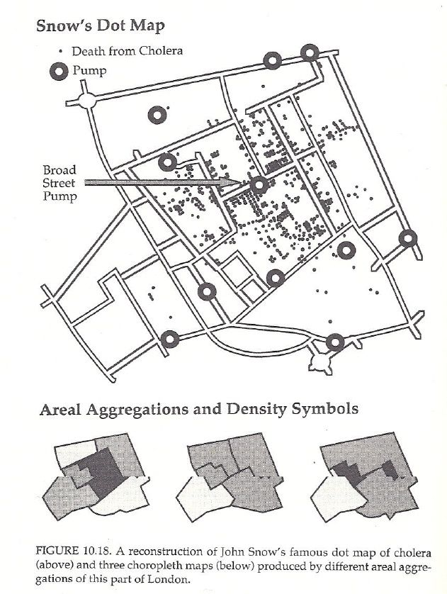

```{r setup, include=FALSE}
knitr::opts_chunk$set(echo = FALSE)
library(tidyverse)
```

## Visualizations {.build}

- Statistics can be misleading
- When it's life or death
- Grammar of Graphics & ggplot
- Exploratory Data Analysis
- HTML Widgets
- Shiny

# Statistics can be misleading

> “The greatest value of a picture is when it forces us to notice what we never expected to see.” — John Tukey

## Anscombe's Quartet

```{r out.width = "530px", fig.align="center"}
knitr::include_graphics("./img/anscombe.png")
```

[Wikipedia: Anscombe's Quartet](https://en.wikipedia.org/wiki/Anscombe%27s_quartet)

<div class="notes">

- mean(x) = 9: exact
- var(x) = 11: exact
- mean(y) = 7.50 ~2 decimal places
- var(y) =	4.125 ~plus/minus 0.003
- p = 0.816 :	~ 3 decimal places
- Regression:	y = 3.00 + 0.500x : ~2 and 3 decimal places, respectively
- R^2 =	0.67: ~2 decimal places

</div>

## Dino Data


<https://www.autodeskresearch.com/publications/samestats>

## Dino Data

```{r out.width = "650px", fig.align="center"}
knitr::include_graphics("./img/allDinos.png")
```

<https://www.autodeskresearch.com/publications/samestats>

## Dino Data in R

```{r}
library(datasauRus); library(ggplot2)
ggplot2::ggplot(datasaurus_dozen, aes(x=x, y=y, colour=dataset))+
  geom_point()+
  theme_void()+
  theme(legend.position = "none")+
  facet_wrap(~dataset, ncol=5)
```

[datasauRus R package](https://cran.r-project.org/web/packages/datasauRus/vignettes/Datasaurus.html)

## Box Plots

<center>
<div class="centered">

</div>
</center>

<center>
<div class="centered">

</div>
</center>

<https://www.autodeskresearch.com/publications/samestats>

# When it's Life or Death

```{r out.width = "200px", fig.align="center"}
knitr::include_graphics("./img/visual-explanations.jpg")
```

## Cholera in London: 1854

```{r out.width = "330px", fig.align="center"}
knitr::include_graphics("./img/cholera_cartoon.jpg")
```

## John Snow

```{r out.width = "600px", fig.align="center"}

```

## The other John Snow

```{r out.width = "320px", fig.align="center"}
knitr::include_graphics("./img/John_Snow.jpg")
```

## Snow's Map

```{r out.width = "560px", fig.align="center"}
knitr::include_graphics("./img/snow_map.png")
```

## Tufte's Design

1. Place data in an appropriate context for assessing **cause and effect**.

2. Making quantitatives comparisons (e.g., Workhouse & Brewery).

3. Considering alternative explanations and contrary cases.

4. Assessment for possible errors (e.g., Compared with what?)

## Compared with What?

```{r out.width = "330px", fig.align="center"}

```

Mark Monmonier's "How to Lie with Maps" (1991) 

## Challenger

```{r out.width = "400px", fig.align="center"}
knitr::include_graphics("./img/challenger.jpg")
```

## Challenger: Presidential Commission

```{r out.width = "630px", fig.align="center"}
knitr::include_graphics("./img/oring.png")
```

Chartjunk, lack of cause-effect, & wrong order (Tufte, p. 48). See the bottom.

## Richard Feynman's Ice Dunk

[](http://www.youtube.com/watch?v=raMmRKGkGD4 "Feynman")

## Tufte's Take


Source: Tufte, Visual Explanations

# Grammar of Graphics & ggplot2

[](http://vita.had.co.nz/papers/layered-grammar.html "Grammar of Graphics")

## 1812 Napoleon Russia Invasion


## ggplot2

```{r warning=FALSE, message=FALSE}
troops <- read.table("../data/minard-troops.txt", header=T)
cities <- read.table("../data/minard-cities.txt", header=T)

library(ggplot2); library(scales)

plot_troops <- ggplot(troops, aes(long, lat)) +
  geom_path(aes(size = survivors, colour = direction, group = group))
  
plot_both <- plot_troops + 
  geom_text(aes(label = city), size = 4, data = cities)
  
plot_polished <- plot_both + 
  scale_size(breaks = c(1, 2, 3) * 10^5, labels = comma(c(1, 2, 3) * 10^5)) + 
  scale_colour_manual(values = c("grey50","red")) +
  xlab(NULL) + 
  ylab(NULL)

plot_polished
```

## ggplot2 (code)

```{r eval=FALSE, echo=TRUE}
troops <- read.table("../data/minard-troops.txt", header=T)
cities <- read.table("../data/minard-cities.txt", header=T)

library(ggplot2); library(scales)

plot_troops <- ggplot(troops, aes(long, lat)) +
  geom_path(aes(size = survivors, colour = direction, group = group))
  
plot_both <- plot_troops + 
  geom_text(aes(label = city), size = 4, data = cities)
  
plot_polished <- plot_both + 
  scale_size(breaks = c(1, 2, 3) * 10^5, labels = comma(c(1, 2, 3) * 10^5)) + 
  scale_colour_manual(values = c("grey50","red")) +
  xlab(NULL) + 
  ylab(NULL)
```

## Follow along: Viz Chapter

[G. Grolemund's Tidyverse Webinar](https://github.com/rstudio/webinars/raw/master/46-tidyverse-visualisation-and-manipulation-basics/00-Tidyverse-webinar.pdf)

Follow along on the online book: 

<http://r4ds.had.co.nz/data-visualisation.html>

# Exploratory Data Analysis: Tukey


## Two Questions

- What type of **variation** occurs within my variables?

- What type of **covariation** occurs between my variables?


## Variation: Categorical

```{r echo=TRUE}
ggplot(data = diamonds) +
  geom_bar(mapping = aes(x = cut))
```

## Variation: Continuous

```{r echo=TRUE}
ggplot(data = diamonds) +
  geom_histogram(mapping = aes(x = carat), binwidth = 0.5)
```

## Variation: Box-Plot

```{r echo=TRUE}
ggplot(data = diamonds, mapping = aes(x = cut, y = price)) +
  geom_boxplot()
```

## Variation: Box-Plot

```{r echo=TRUE}
ggplot(data = mpg) +
  geom_boxplot(mapping = aes(x = reorder(class, hwy, FUN = median), y = hwy)) + coord_flip()
```

## Co-Variation: Discrete

```{r echo=TRUE}
ggplot(data = diamonds) +
  geom_count(mapping = aes(x = cut, y = color))
```

## Co-Variation: Discrete (2)

```{r echo=TRUE}
diamonds %>% count(color, cut) %>%  
  ggplot(mapping = aes(x = color, y = cut)) +
    geom_tile(mapping = aes(fill = n))
```

## Co-Variation: Continous

```{r echo=TRUE}
ggplot(data = diamonds) +
  geom_point(mapping = aes(x = carat, y = price))
```

## Application of Co-variation: Continuous

Stochastic random walks; used in pricing financial derivatives.

```{r echo=TRUE, message=FALSE}
set.seed(2)
d <- purrr::map_dfr(letters, ~ data.frame(idx = 1:400,
               value = cumsum(runif(400, -1, 1)),
               type = .,
               stringsAsFactors = FALSE))

# save ggplot object as g
g <- ggplot(d) +
  geom_line(aes(idx, value, colour = type))
```

## Application of Co-variation: Continuous

```{r echo=TRUE, message=FALSE}
# runs ggplot object
g
```

# HTML Widgets

<http://gallery.htmlwidgets.org/>

# Shiny

[M. Cetinkaya-Rundel Intro to Shiny Webinar](https://github.com/rstudio/webinars/raw/master/47-introduction-to-shiny/intro-to-shiny.pdf)

## Other Shiny Materials

- Three hour Shiny webinar: <https://shiny.rstudio.com/tutorial/>

- R Studio Shiny articles: <https://shiny.rstudio.com/articles/>

- Example of Shiny App: <https://github.com/wesslen/topicApp/>

## "Assignment"

1.  Create a shiny app that runs [k-means clustering app](https://shiny.rstudio.com/gallery/kmeans-example.html) with the [`dinosauRus`](https://cran.r-project.org/web/packages/datasauRus/vignettes/Datasaurus.html) package data. Ideally, it would have a dropdown widget to choose which dataset.

2.  Even better, get a [shinyapps.io](https://www.shinyapps.io/) and publish it.

3.  Even even better, push your code onto GitHub. Try to follow the [R package structure](http://r-pkgs.had.co.nz/package.html).

How well does k-means clustering do? 

Which distributions does it do really bad.